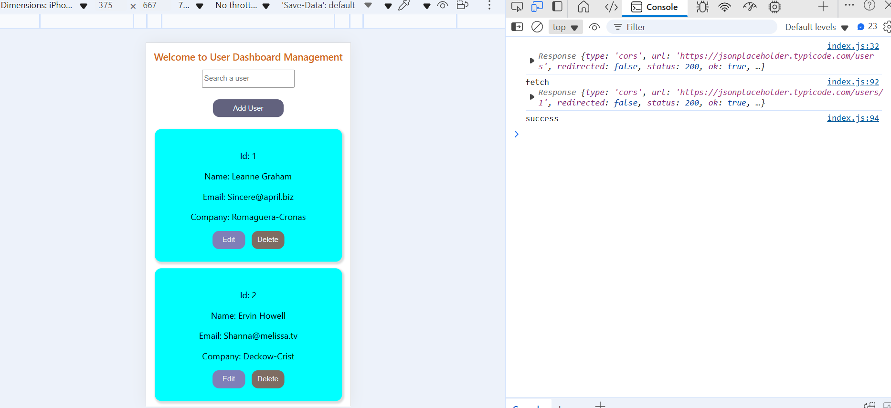

#To run this application you need to clone the repo 

in your vs terminal paste git clone (myrepo)
after that you need to change the directory like cd my-app 
after entering the directory you need to install all the packages 
npm install 
after that you need to run the application by using npm start 

#Implemented all the provided functionalities 
like pagination ,searching,fetching ,edit,delete,add,get 

#faced challenges are like after fetching the data i didn't seen any deparement section 
then i decided to changed it to comapany 
atleast provided url contains the department is benefit any way done with the company 

#techonologies react,modal ,css 
fetch

#After edit user send the data to servers 
here is success response image

